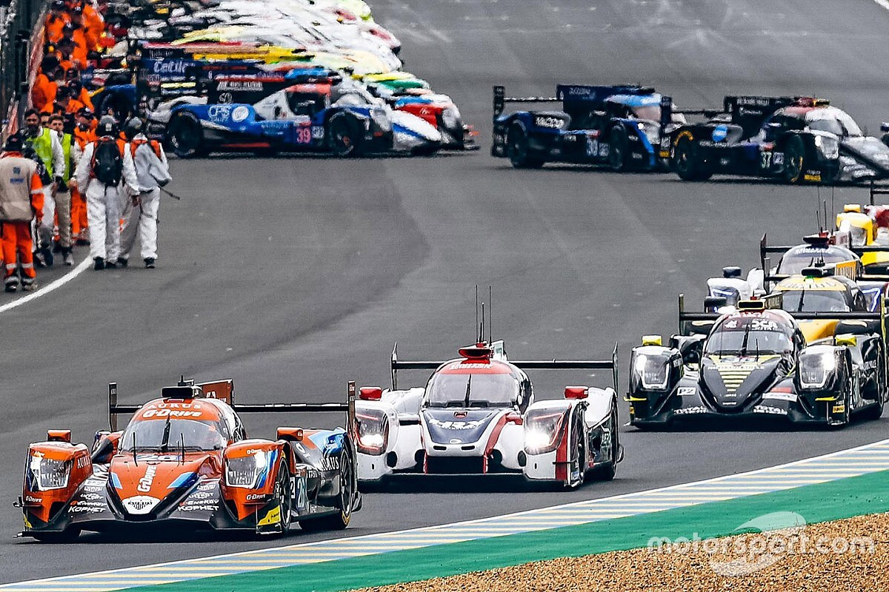

# 24-Horas-de-Le-Mans

# Problema:
Dadas las condiciónes actuales de Pandemia a nivel mundial, los organizadores de las famosas 24 horas de Le Mans, nos piden desarrollar un programa en el que se evidencie el estricto comportamiento de la gente de los Boxes, no quieren que ingresen en simultaneo mas de cierta cantidad de autos para evitar aglomeración de gente en los pits y de esta forma mantener el distanciamiento social. Es por eso que se ve limitada de antemano la cantidad de pits habilitados para atender a sus corredores, el ingreso a la zona de Boxes entonces queda reducida a un número dado y los competidores deberán seguir corriendo en la pista, hasta tanto no se les habilite el ingreso, si tienen suerte.

# Entorno real:
Si bien en una carrera de Le Mans los pits estan abiertos siempre, puesto que es una carrera de 24 horas continuas, en esta versión se acotar esa cantidad, aunque si bien el ejercicio se podría resolver utilizando colas, esto no representaría fehacientemente el hecho de que los "autos" compitan, ademas de hacerlo en la pista, sino también para ingresar a los pits, puesto que no todos lo podrán hacer al mismo tiempo. Esto se ve reflejado en el uso de banderas, tal cual lo implementan las diferentes carreras automovilisticas. En este caso, nos interesaran la bandera albondiga, que es la que llama a boxes, la bandera verde, que sera la que habilite el retorno a la carrera del auto que ingreso al pit, y una bandera roja cruzada, que significará que los boxes estan llenos y deberá esperar.

# Ventajas y necesidades de utilizar concurrencia:
La ventaja y necesidad de utilizar concurrencia en este caso, se da en que los diferentes procesos se mantienen constantemente corriendo y en cualquier momento podrán acceder a la otra parte del programa, haciendolo de esta manera mas dinámico, a diferencia de si en el caso utilizar una cola, esta relantizaria este proceso por el orden de llegada y ya no sería dinámico, sino un ordenamiento, y a su vez se alejaría del requerimiento.

# En cuanto al código:
Para el desarrollo este ejercicio se utilizaron listas y monitores, la metodología implementada a través de estos es muy simple. Al igual que una carrera de Le Mans (o cualquier otra carrera de este estilo) Dan aviso (en la vida real, levantan una bandera verde para comunicar que todo siga su curso) de cuando un elemento sale de una lista para ingresar en la otra. Dado el contexto, cuando un “Auto” ingresa a Boxes y cuando sale de Boxes e ingresa a la “Pista”.
Es completamente seteable, desde la cantidad de “corredores” hasta los “pits” habilitados.

# En lo personal:
Se me presento esta idea desde una de las primeras clases, al oír que los “hilos” compiten entre sí, el desarrollo del problema no fue un inconveniente en sí, puesto que la idea la venia pensando desde hace tiempo. El uso de listas me facilitó la implementación del monitor, y por eso me volqué a su utilización. De mas está aclarar que no hay, a mi entender, mejor ejemplo para evidenciar un caso de concurrencia, que una carrera de autos. 

# Material consultado de la red:
http://webdiis.unizar.es/~ezpeleta/lib/exe/fetch.php?media=misdatos:pc:10.pdf
http://www.laminfo.com/blog/archivos/__Teoria_1_Programacion_Concurrente.pdf

El desarrollo del problema y su solución es íntegramente idea de Sebastián Brandariz.
